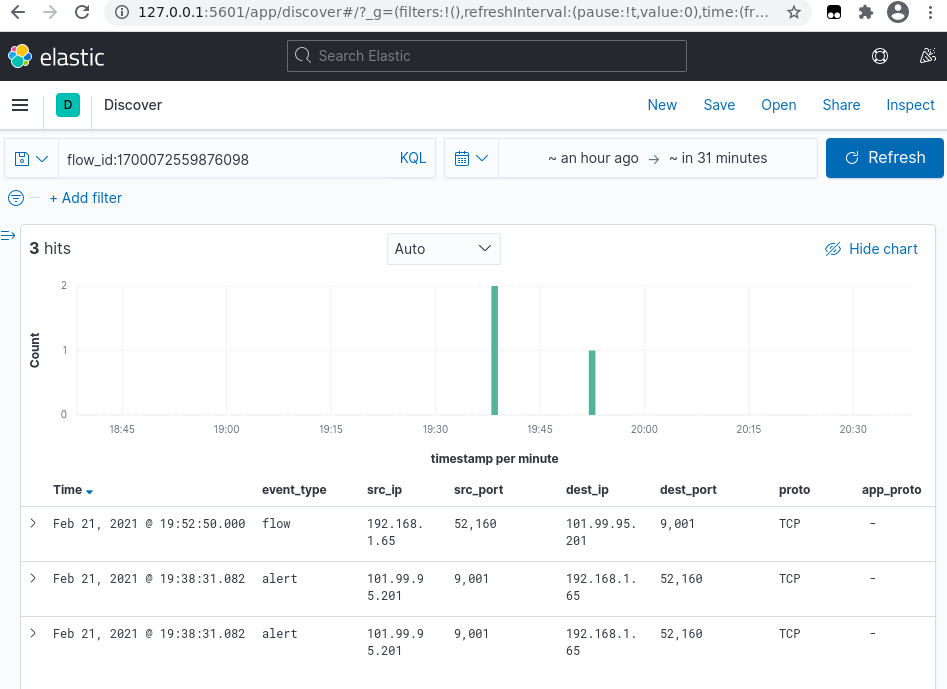

# frosty
Automated use of an IDS and open source intel

The intention of this project is to automate the use of the IDS (Intrusion Detection System) [Suricata](https://suricata-ids.org) by generating emails for alerts that identify potential indicators of compromise in local network traffic.

# Setup
## Suricata
### Debian (Buster)
```sh
apt-get install suricata suricata-oinkmaster

# modify /etc/suricata/suricata.yaml 
# the defaults are sufficient but the af-packet.interface must be set correctly
# refer to setup/debian-buster/suricata.yaml.orig and suricata.yaml files for recommended changes
(cd /etc/suricata; cp suricata.yaml suricata.yaml.orig; vi suricata.yaml)
systemctl restart suricata

# the default /etc/suricata/suricata-oinkmaster.conf is sufficient
# however can use an oinkcode for with emerging threats pro: 
(cd /etc/suricata; mv suricata-oinkmaster.conf suricata-oinkmaster.conf.orig; \
    awk '/^url/ {
             print "#"$0;
             print "url = https://rules.emergingthreatspro.com/<oinkcode>/suricata-4.0/etpro.rules.tar.gz";
             next
         }
         { print $0 }
    ' <suricata-oinkmaster.conf.orig >suricata-oinkmaster.conf)
    
# can also optionally specify rules to be ignored:
# refer to /etc/oinkmaster.conf
# to specify files to ignore, add "skipfile <file>"
# to specify rules to ignore, add "disablesid <sid>"

# update emerging threats ruleset (this will be run in a daily cron)
suricata-oinkmaster-updater
```

## MTA (Mail Transfer Agent)
An MTA should be installed by default.  Verify mail can be sent using it to a local mail spool:
```pycon
>>> import smtplib
>>> smtp = smtplib.SMTP('127.0.0.1')
>>> smtp.set_debuglevel(True)
>>> smtp.sendmail('frosty@localhost', 'root@localhost', 'this is a test')
send: 'ehlo [127.0.1.1]\r\n'
reply: b'250-localhost Hello localhost [127.0.0.1]\r\n'
reply: b'250-SIZE 52428800\r\n'
reply: b'250-8BITMIME\r\n'
reply: b'250-PIPELINING\r\n'
reply: b'250-CHUNKING\r\n'
reply: b'250-PRDR\r\n'
reply: b'250 HELP\r\n'
reply: retcode (250); Msg: b'localhost Hello localhost [127.0.0.1]\nSIZE 52428800\n8BITMIME\nPIPELINING\nCHUNKING\nPRDR\nHELP'
send: 'mail FROM:<frosty@localhost> size=14\r\n'
reply: b'250 OK\r\n'
reply: retcode (250); Msg: b'OK'
send: 'rcpt TO:<root@localhost>\r\n'
reply: b'250 Accepted\r\n'
reply: retcode (250); Msg: b'Accepted'
send: 'data\r\n'
reply: b'354 Enter message, ending with "." on a line by itself\r\n'
reply: retcode (354); Msg: b'Enter message, ending with "." on a line by itself'
data: (354, b'Enter message, ending with "." on a line by itself')
send: b'this is a test\r\n.\r\n'
reply: b'250 OK id=1lDM0U-0002wM-1W\r\n'
reply: retcode (250); Msg: b'OK id=1lDM0U-0002wM-1W'
data: (250, b'OK id=1lDM0U-0002wM-1W')
{}
```

## Systemd
```sh
# refer to systemd.unit(5) systemd.service(5) systemd.exec(5) ...
cat <<EOF >/etc/systemd/system/frosty.service
[Unit]
Description=frosty
After=suricata.service
Documentation=https://github.com/jo-makar/frosty

[Service]
Type=simple
ExecStart=</path/to/frosty.py> <args>
Restart=on-failure
User=<user> # does not need to be root
WorkingDirectory=</parent/path/of/frosty.py>

[Install]
WantedBy=multi-user.target
EOF

systemctl daemon-reload
systemctl start frosty
systemctl enable frosty
```

## ELK (Elasticsearch, Logstash, Kibana) stack
This is optional but recommended as it provides context when investigating alerts.

### Debian
```sh
# refer to https://www.elastic.co/guide/en/elasticsearch/reference/current/deb.html 

wget -qO - https://artifacts.elastic.co/GPG-KEY-elasticsearch | apt-key add -
echo "deb https://artifacts.elastic.co/packages/7.x/apt stable main" >/etc/apt/sources.list.d/elastic-7.x.list
apt-get update && apt-get install elasticsearch logstash kibana

# ensure only 2gb of heap is used
cat <<EOF >/etc/elasticsearch/jvm.options.d/heap.options
-Xms2g
-Xmx2g
EOF

systemctl daemon-reload
systemctl start elasticsearch 
systemctl enable elasticsearch

systemctl start kibana
systemctl enable kibana

# define the config before starting
# refer to https://www.elastic.co/guide/en/logstash/current/plugins-inputs-file.html
#          https://www.elastic.co/guide/en/logstash/current/plugins-outputs-tcp.html
#          https://www.elastic.co/guide/en/logstash/current/plugins-outputs-elasticsearch.html

cat <<EOF >/etc/logstash/config.d/100-frosty.conf
input {
  file {
    path => ["/var/log/suricata/eve.json"]
    codec => "json"
    mode => "tail"
    start_position => "end"
    add_field => { "[@metadata][pipeline]" => "frosty" }
  }
}

output {
  if [@metadata][pipeline] == "frosty" {
    elasticsearch {
      action => "index"
      hosts => ["http://127.0.0.1:9200"]
      index => "suricata-%{+yyyyMMdd}"
      # TODO define a template and specify it here
    }
    
    if [event_type] == "alert" {
      tcp {
        host => "127.0.0.1"
        port => 7834 # arbitrary choice
        mode => "client"
        codec => "json_lines"
      }
    }
  }
}
EOF

systemctl start logstash
systemctl enable logstash
```

# Options
```sh
$ ./frosty.py -h
usage: frosty.py [-h] [--debug] (--minimal | --elastic)

optional arguments:
  -h, --help            show this help message and exit
  --debug, -d
  --minimal, --min, -m
  --elastic, --elk, -e
```

Minimal or elastic mode must be specified.  Minimal mode monitors the eve.json output and sends mails to root as alerts are generated.  Elastic mode receives alert records from logstash and generates mails with the associated alert in Kibana.

# Try it out!
## Minimal mode
```sh
# grep ^alert /etc/suricata/rules/tor.rules | head -1
alert tcp [101.99.95.201,103.228.53.155,103.234.220.195,103.236.201.88,103.249.28.195,103.253.41.98,103.28.52.93,103.35.74.74,103.75.190.11,104.149.134.118] any -> $HOME_NET any (msg:"ET TOR Known Tor Exit Node Traffic group 1"; reference:url,doc.emergingthreats.net/bin/view/Main/TorRules; threshold: type limit, track by_src, seconds 60, count 1; classtype:misc-attack; flowbits:set,ET.TorIP; sid:2520000; rev:4346; metadata:affected_product Any, attack_target Any, deployment Perimeter, tag TOR, signature_severity Audit, created_at 2008_12_01, updated_at 2021_02_19;)
# nc -w1 -v 101.99.95.201 9001
Connection to 101.99.95.201 9001 port [tcp/*] succeeded!

notification mails are sent in batches every five minutes
after no more than five minutes expect the corresponding mail:

$ mail
"/var/mail/jom": 1 message 1 new
>N   1 frosty@localhost   Sat Feb 20 21:26 123/3095  suricata alerts
? 1
Return-path: <frosty@localhost>
Envelope-to: root@localhost
Delivery-date: Sat, 20 Feb 2021 21:26:02 -0500
Received: from localhost ([127.0.0.1] helo=[127.0.1.1])
        by localhost with esmtp (Exim 4.92)
        (envelope-from <frosty@localhost>)
        id 1lDeRd-0002s4-TZ
        for root@localhost; Sat, 20 Feb 2021 21:26:01 -0500
Subject: suricata alerts
From: frosty@localhost
Message-Id: <E1lDeRd-0002s4-TZ@localhost>
Date: Sat, 20 Feb 2021 21:26:01 -0500

{
    "timestamp": "2021-02-20T21:21:06.695534-0500",
    "flow_id": 1700754495777475,
    "in_iface": "wlp1s0",
    "event_type": "alert",
    "src_ip": "101.99.95.201",
    "src_port": 9001,
    "dest_ip": "192.168.1.65",
    "dest_port": 45548,
    "proto": "TCP",
    "metadata": {
        "flowbits": [
            "ET.TorIP"
        ]
    },
    "alert": {
        "action": "allowed",
        "gid": 1,
        "signature_id": 2520000,
        "rev": 4346,
        "signature": "ET TOR Known Tor Exit Node Traffic group 1",
        "category": "Misc Attack",
        "severity": 2,
        "metadata": {
            "updated_at": [
                "2021_02_19"
            ],
            "created_at": [
                "2008_12_01"
            ],
            "signature_severity": [
                "Audit"
            ],
            "tag": [
                "TOR"
            ],
            "deployment": [
                "Perimeter"
            ],
            "attack_target": [
                "Any"
            ],
            "affected_product": [
                "Any"
            ]
        }
    },
    "flow": {
        "pkts_toserver": 1,
        "pkts_toclient": 1,
        "bytes_toserver": 74,
        "bytes_toclient": 74,
        "start": "2021-02-20T21:21:06.273091-0500"
    }
}
{
    "timestamp": "2021-02-20T21:21:06.695534-0500",
    "flow_id": 1700754495777475,
    "in_iface": "wlp1s0",
    "event_type": "alert",
    "src_ip": "101.99.95.201",
    "src_port": 9001,
    "dest_ip": "192.168.1.65",
    "dest_port": 45548,
    "proto": "TCP",
    "metadata": {
        "flowbits": [
            "ET.TorIP"
        ]
    },
    "flow": {
        "pkts_toserver": 1,
        "pkts_toclient": 1,
        "bytes_toserver": 74,
        "bytes_toclient": 74,
        "start": "2021-02-20T21:21:06.273091-0500"
    },
    "alert": {
        "action": "allowed",
        "gid": 1,
        "signature_id": 2522000,
        "rev": 4346,
        "signature": "ET TOR Known Tor Relay/Router (Not Exit) Node Traffic group 1",
        "category": "Misc Attack",
        "severity": 2,
        "metadata": {
            "updated_at": [
                "2021_02_19"
            ],
            "created_at": [
                "2008_12_01"
            ],
            "signature_severity": [
                "Audit"
            ],
            "tag": [
                "TOR"
            ],
            "deployment": [
                "Perimeter"
            ],
            "attack_target": [
                "Any"
            ],
            "affected_product": [
                "Any"
            ]
        }
    }
}
```

## Elastic mode
```sh
# grep ^alert /etc/suricata/rules/tor.rules | head -1
alert tcp [101.99.95.201,103.228.53.155,103.234.220.195,103.236.201.88,103.249.28.195,103.253.41.98,103.28.52.93,103.35.74.74,103.75.190.11,104.149.134.118] any -> $HOME_NET any (msg:"ET TOR Known Tor Exit Node Traffic group 1"; reference:url,doc.emergingthreats.net/bin/view/Main/TorRules; threshold: type limit, track by_src, seconds 60, count 1; classtype:misc-attack; flowbits:set,ET.TorIP; sid:2520000; rev:4346; metadata:affected_product Any, attack_target Any, deployment Perimeter, tag TOR, signature_severity Audit, created_at 2008_12_01, updated_at 2021_02_19;)
# nc -w1 -v 101.99.95.201 9001
Connection to 101.99.95.201 9001 port [tcp/*] succeeded!

notification mails are sent in batches every five minutes
after no more than five minutes expect the corresponding mail:

$ mail
"/var/mail/jom": 1 message 1 new
>N   1 frosty@localhost   Sun Feb 21 19:43 19/1351  suricata alerts
? 1
Return-path: <frosty@localhost>
Envelope-to: root@localhost
Delivery-date: Sun, 21 Feb 2021 19:43:27 -0500
Received: from localhost ([127.0.0.1] helo=[127.0.1.1])
        by localhost with esmtp (Exim 4.92)
        (envelope-from <frosty@localhost>)
        id 1lDzJv-00031B-8j
        for root@localhost; Sun, 21 Feb 2021 19:43:27 -0500
Subject: suricata alerts
From: frosty@localhost
Message-Id: <E1lDzJv-00031B-8j@localhost>
Date: Sun, 21 Feb 2021 19:43:27 -0500

ET TOR Known Tor Exit Node Traffic group 1
http://127.0.0.1:5601/app/discover#/?_g=(filters:!(),refreshInterval:(pause:!t,value:0),time:(from:'2021-02-21T18:38:30.792578-05:00',to:'2021-02-21T20:38:31.082985-05:00'))&_a=(columns:!(event_type,src_ip,src_port,dest_ip,dest_port,proto,app_proto),filters:!(),index:'0170a7e0-7409-11eb-9879-6bf568a6cc4d',interval:auto,sort:!(),query:(language:kuery,query:'flow_id:1700072559876098'))

ET TOR Known Tor Relay/Router (Not Exit) Node Traffic group 1
http://127.0.0.1:5601/app/discover#/?_g=(filters:!(),refreshInterval:(pause:!t,value:0),time:(from:'2021-02-21T18:38:30.792578-05:00',to:'2021-02-21T20:38:31.082985-05:00'))&_a=(columns:!(event_type,src_ip,src_port,dest_ip,dest_port,proto,app_proto),filters:!(),index:'0170a7e0-7409-11eb-9879-6bf568a6cc4d',interval:auto,sort:!(),query:(language:kuery,query:'flow_id:1700072559876098'))
```

The generated Kibana links show the records associated with the alerts:



# Elastic mode crons
- [Delete records older than 90 days](crons/cleanup.py)
- [Weekly report of http/https hosts by connection and bandwidth](crons/http-stats.py)
  - TODO How could this be done as a Kibana visualization or dashboard instead?

## TODO
- Weekly report of unusual traffic (unusual ports to start)
- Weekly report summarizing alerts 
- Weekly report to identify Suricata  performance issues (via stats records, eg kernel_drops)
- Weekly report showing local network topology

